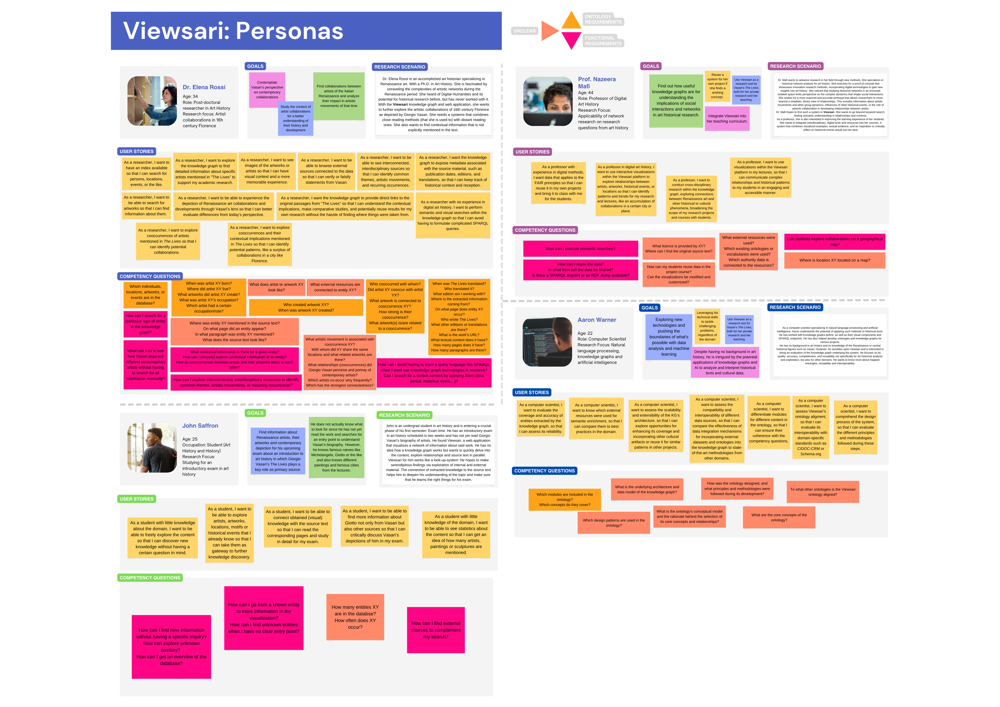
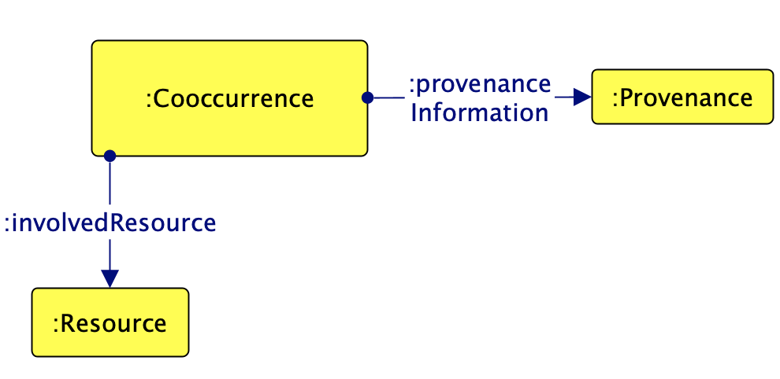
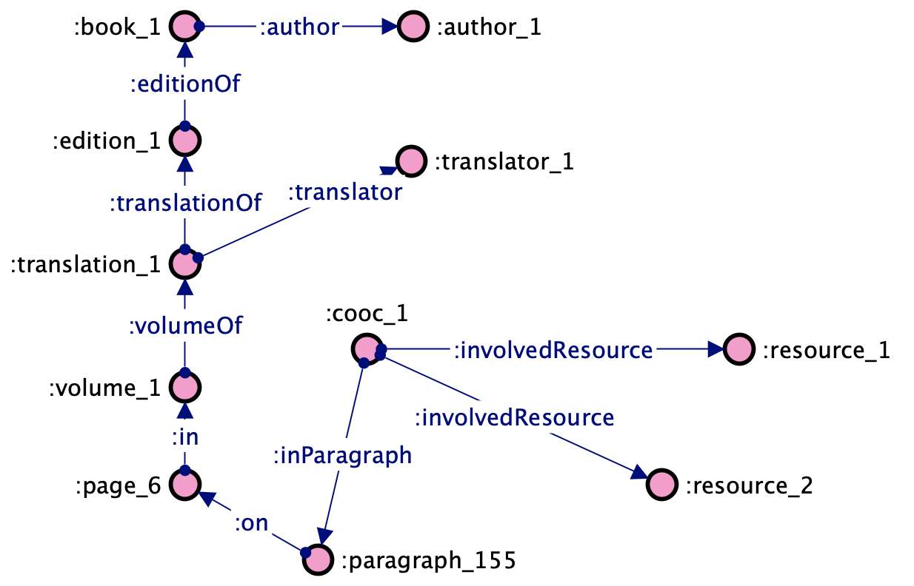
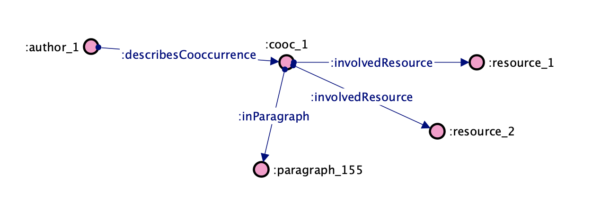
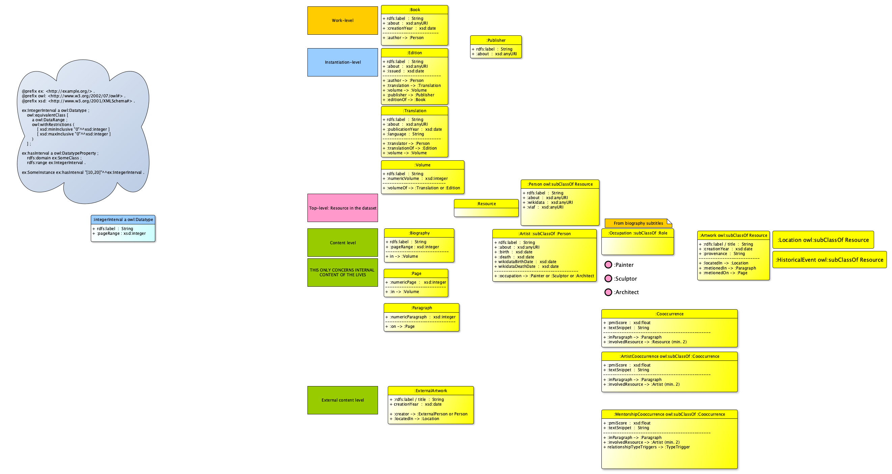
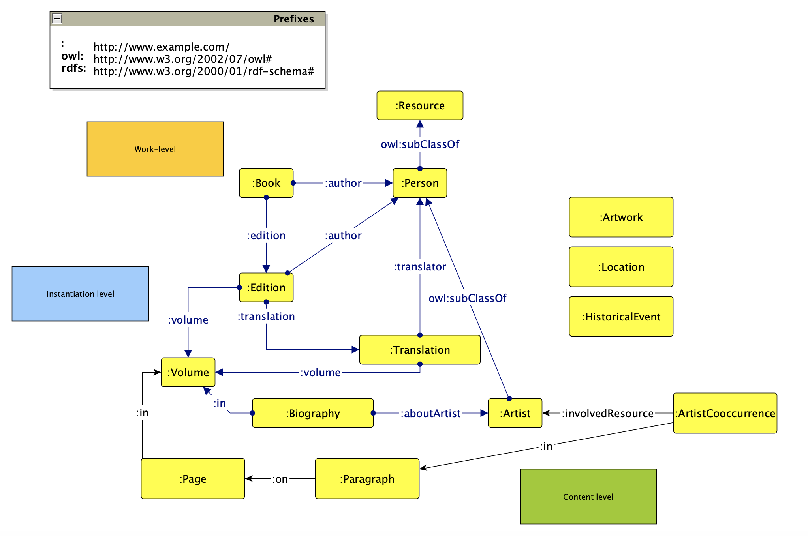

# The Viewsari Knowledge Graph (KG)

This GitHub repository is a collection of different code contributing to the devlopment of Viewsari.
The Viewsari KG acts as a gateway to *Vasari's Renaissance*, aiming to transform Giorgio Vasari's chef-d'œuvre *Lives of the Most Eminent Painters Sculptors and Architects* into a flexible and scalable graph representation of the text and its contents. Viewsari is intended as an integrated system of ontology, KG, and website and, in the future, shall provide the possibility to explore and query information related to artists, their shared relationships, their artworks, and other connected entities. The data model is based on the Resource Description Framework (RDF) and the W3C Web Ontology Language (OWL).

To achieve this, this project subsumises different parts:

1. Information extraction (IE) (named entitiy extraction, motif and genre extraction, relation extraction), entity linking, etc.
    1. Large Language Models (LLMs) for IE
2. Ontology engineering with state-of-the-art methodologies like eXtreme Design (XD) [1]
    - Case study of best practices applied to DH ontology Design
    - Reuse and proposition of Ontology Design Patterns (ODPs) [1]
3. Modeling social networks in KGs - layered perspectives
4. Modeling the text as a graph - KGs for digital scholarly editions in digital art history
5. Populating the KG with data

This list is not extensive and will be expanded throughout the project's progress.

# Entity Extraction
Viewsari uses the translated English edition of The Lives for all
knowledge extraction and engineering steps. Gaston C. Du Vere wrote said translation in 1912
based on the 1568 edition. A digital edition of Du Vere’s translation is available in ten volumes, each containing a subset of all biographies.
For entity extraction, [the previous project team](https://github.com/ISE-FIZKarlsruhe/vasari_nlp/) conducted experiments on entity 
recognition and entity linking
They extracted the following entities: persons, organizations, places, and miscellaneous (all following the CoNLL 2003 dataset, partially linked
to Wikidata), as well as artwork references, motifs, terms, and dates. 
[In another project step](https://github.com/ISE-FIZKarlsruhe/vasari_network), they modeled relationships between artists through co-reference resolution and statistical association from the cooccurrence of names in
paragraphs to create the social network.

In Viewsari, we plan to extend this example set of entities through further extraction steps.

# Ontology Engineering with XD
For creating the ontology behind the Viewsari KG, our team follows the XD methodology, also reusing and proposing ODPs.
## Requirements Engineering
Requirements engineering is the process of gathering, analyzing, and formalizing requirements for a system (an ontology / KG in our case).
### User Interviews
From user interviews with five stakeholders from the art history domain, we gathered needs and wishes for Viewsari. We collected those
in personas and adjacent user stories.
### User Stories, Personas
We created four personas representing potential stakeholders. They have user scenarios and user requirements, as well as a set of competency questions. These parts are not rigid and can be adjusted with progress in the project.

## Mapping to ODPs 
In order to increase the interoperability of our ontology, we matched the CQs to existing ODPs (and also created new ones).
We reuse the [Persons](http://ontologydesignpatterns.org/wiki/Submissions:Persons) and [Location](http://ontologydesignpatterns.org/wiki/Submissions:Place) CP from submissions in the [ODP repository](http://ontologydesignpatterns.org/wiki/Main_Page).
Most importantly, we use the [Provenance](http://ontologydesignpatterns.org/wiki/Submissions:Provenance) CP as inspiration for the representation of source evidence for extracted entities and cooccurrences. The solution in the repository does not fully match our use case,
so we adapt it accordingly. We propose a cooccurrence class that has provenance information (e.g. a paragraph) and connects two or more resources.
The examples below showcase what this would look like with data. We also propose a shortcut for authors and their connection to the
cooccurrence.

## Formalization
In the formalization step, we construct a first foundational ontology for Viewsari. This ontology includes the following classes:

For a better view, please open the file in the [directory](https://github.com/ISE-FIZKarlsruhe/viewsari/tree/main/img)

An exemplary view of how cooccurrences are connected to the work level:

## References

[1] E. Blomqvist, K. Hammar, V. Presutti, Engineering Ontologies with Patterns - The eXtreme
Design Methodology., in: Ontology Engineering with Ontology Design Patterns - Founda-
tions and Applications, 2016, pp. 23–50. doi:10.3233/978-1-61499-676
