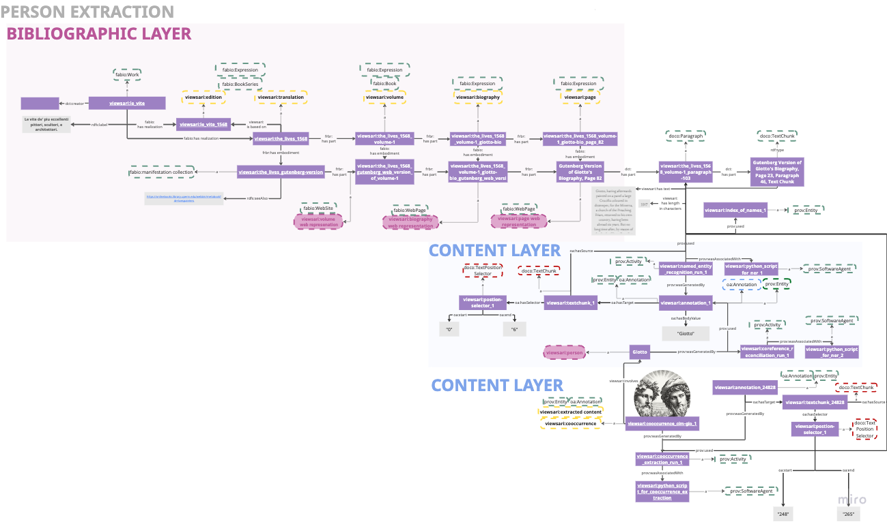

# Viewsari Ontology

**Namespace:** `https://viewsari.ise.fiz-karlsruhe.de/ontology/`  
**Preferred prefix:** `viewsari`  
**File:** `viewsari_ontology.rdf` (OWL/RDF-XML, OWL API 4.5.29)  
**License:** [CC BY 4.0](https://creativecommons.org/licenses/by/4.0/)  
**Author:** Sarah Rebecca Ondraszek — FIZ Karlsruhe, Information Service Engineering

This directory is the **E1** artifact of the project. It operationalizes:

- **C1** — the rejection of the pre-interpretive entity assumption (PIEA), through the three-layer architecture (bibliographic / structural / content) that keeps mention, referent, and bibliographic source distinct,
- **C4** — the Computational Provenance (COMP-PROV) ontology design pattern, by reifying extraction agent, prompt, model version, and run as first-class entities linked to every extracted assertion.

It is the schema the populated KG ([`data/kg/viewsari_kg.ttl`](../kg/viewsari_kg.ttl)) instantiates and the schema that [`src/evaluation/run_cq_evaluation.py`](../../src/evaluation/run_cq_evaluation.py) evaluates competency-question coverage against. See [`CQ_CATALOG.md`](./CQ_CATALOG.md) for the full catalog of CQs and the [top-level README](../../README.md#dissertation-contributions--repository-map) for the repository-wide contribution map.

---

## Overview

The Viewsari ontology provides the formal vocabulary for the
[Viewsari Knowledge Graph](https://github.com/ISE-FIZKarlsruhe/viewsari),
a provenance-aware knowledge graph built from Giorgio Vasari's
*Le Vite de' più eccellenti pittori, scultori, e architettori* (1568),
specifically the 1912 English translation by Gaston C. du Vere, as
digitized by [Project Gutenberg](https://www.gutenberg.org/ebooks/25326).

The ontology's central design claim is that knowledge extracted from
interpretive historical texts is not merely *discovered* but
*constructed* — and that the knowledge graph must therefore model the
construction process itself, not only its output. Every extracted entity
and every mention annotation is traceable, via typed PROV-O activities,
to the paragraph it came from, the software that produced it, and the
prompt template or index resource that guided extraction.

The ontology is developed within the eXtreme Design (XD) methodology and
has been validated iteratively against the competency questions cataloged
in [`CQ_CATALOG.md`](./CQ_CATALOG.md), derived from user stories across
four personas (curator, senior art historian, graduate student, software
engineer).



---

## Three-layer architecture

The ontology is organized into three representational layers that remain
stable across all design iterations.

### Bibliographic layer

Models the intellectual and digital structure of *The Lives* following
the FRBR framework as implemented in FaBiO.

```
fabio:Work
  └── viewsari:le_vite            (Giorgio Vasari's abstract work)
        └── viewsari:edition      (the 1568 Giunti edition)
              └── viewsari:translation  (the 1912 Du Vere English translation)
                    └── viewsari:volume       (one of ten volumes)
                          └── viewsari:biography    (one artist's life)
                                └── viewsari:page   (a single printed page)
```

Each expression-level entity has a corresponding manifestation-level
web representation class that carries a dereferenceable `rdfs:seeAlso`
URL pointing to the Project Gutenberg HTML anchor for that resource:

| Expression class | Manifestation class | Superclass |
|---|---|---|
| `viewsari:volume` | `viewsari:volume_web_representation` | `fabio:WebSite` |
| `viewsari:biography` | `viewsari:biography_web_representation` | `fabio:WebPage` |
| `viewsari:page` | `viewsari:page_web_representation` | `fabio:WebPage` |

### Structural layer

Models the document hierarchy below the page level, using DoCO
vocabulary for paragraph-level content and the W3C Web Annotation
Ontology for anchoring mentions to exact character positions.

- `doco:Paragraph` — carries `viewsari:hasText` (full normalized text),
  `viewsari:hasLengthInCharacters`, `viewsari:hasStartPage`, and
  `viewsari:hasEndPage` (both pointing to
  `viewsari:page_web_representation` instances).
- `doco:TextChunk` — a surface-form span within a paragraph, linked to
  its `oa:TextPositionSelector` via `oa:hasSelector`.
- `oa:TextPositionSelector` — character-level `oa:start` / `oa:end`
  offsets within the paragraph text.

### Content layer

Models the extracted entities and their mention evidence.

**Extracted entities** all inherit from `viewsari:extracted_content`
(`⊑ prov:Entity`):

| Class | Description |
|---|---|
| `viewsari:person` | Historical individual from the Index of Names |
| `viewsari:artwork` | Creative work mentioned in the text |
| `viewsari:location` | Geographical place |
| `viewsari:organization` | Guild, order, academy, or other institution |
| `viewsari:cooccurrence` | Pairwise joint appearance of two entities in one paragraph |

**Mention taxonomy** — all subclasses of `viewsari:mention`
(`⊑ oa:Annotation ⊓ prov:Entity`):

```
viewsari:mention
  ├── viewsari:explicit_mention
  │     └── viewsari:explicit_artwork_mention
  ├── viewsari:implicit_mention
  │     └── viewsari:implicit_artwork_mention
  ├── viewsari:coreferent
  └── viewsari:generic_mention
```

**Extraction activities** — all subclasses of `prov:Activity`:

| Class | Pipeline stage |
|---|---|
| `viewsari:named_entity_recognition` | NER and coreference resolution over the Index of Names and paragraphs |
| `viewsari:cooccurrence_analysis` | Pairwise co-occurrence extraction |
| `viewsari:entity_linking` | LLM-guided candidate ranking and Wikidata linking |

---

## Imported vocabularies

| Prefix | Namespace | Used for |
|---|---|---|
| `fabio` | `http://purl.org/spar/fabio/` | FRBR-aligned bibliographic types |
| `doco` | `http://purl.org/spar/doco/` | Document component types |
| `prov` | `http://www.w3.org/ns/prov#` | Extraction provenance |
| `oa` | `http://www.w3.org/ns/oa#` | Web Annotation (mentions, selectors) |
| `frbr` | `http://purl.org/vocab/frbr/core#` | Part-of and embodiment relations |
| `dct` | `http://purl.org/dc/terms/` | Relation subproperties |

---

## Viewsari-defined properties

### Object properties

| Property | Domain | Range | Description |
|---|---|---|---|
| `viewsari:hasStartPage` | `doco:Paragraph` | `viewsari:page_web_representation` | First printed page of a paragraph |
| `viewsari:hasEndPage` | `doco:Paragraph` | `viewsari:page_web_representation` | Last printed page of a paragraph |
| `viewsari:isBasedOn` | `viewsari:translation` | `viewsari:edition` | Derivation of a translation from its source edition (`⊑ frbr:relatedEndeavour`) |
| `viewsari:inParagraph` | `viewsari:extracted_content` | `doco:Paragraph` | Anchors a co-occurrence to its source paragraph (`⊑ dct:relation`) |
| `viewsari:involves` | `viewsari:cooccurrence` | `viewsari:extracted_content` | Links a co-occurrence to a participating entity; min. cardinality 2 (`⊑ dct:relation`) |

### Datatype properties

| Property | Domain | Range | Description |
|---|---|---|---|
| `viewsari:hasText` | `doco:Paragraph` | `xsd:string` | Full normalized paragraph text (`⊑ oa:bodyValue`) |
| `viewsari:hasLengthInCharacters` | `doco:Paragraph` | `xsd:nonNegativeInteger` | Character count of the merged paragraph |

---

## Fixed individuals

The ontology defines four named individuals that serve as the stable
bibliographic root nodes of the knowledge graph.

| Individual | Type | Description |
|---|---|---|
| `viewsari:le_vite` | `fabio:Work` | The abstract intellectual work by Vasari ([wd:Q1645493](https://www.wikidata.org/wiki/Q1645493)) |
| `viewsari:le_vite_1568` | `viewsari:edition` | The 1568 Giunti edition |
| `viewsari:the_lives_1568` | `viewsari:translation` | The 1912 Du Vere English translation |
| `viewsari:the_lives_gutenberg_version` | `fabio:ManifestationCollection` | The Project Gutenberg web publication of the Du Vere translation |

---

## Provenance chain

The full provenance chain from a raw paragraph to a canonical entity
can be traversed in SPARQL in at most two `prov:wasGeneratedBy` hops:

```
doco:Paragraph
  ←  prov:used  ←  viewsari:named_entity_recognition  (activity)
  →  prov:wasGeneratedBy  →  viewsari:mention  (annotation)
       ↓ prov:used (by coref activity)
       viewsari:cooccurrence_analysis / named_entity_recognition
       →  prov:wasGeneratedBy  →  viewsari:person / viewsari:artwork / viewsari:cooccurrence
```

This design satisfies the central provenance requirement of the
Viewsari project: every triple in the knowledge graph is traceable
to a documented computational activity and ultimately to a specific
paragraph in a specific volume of the Du Vere edition.

---

## Competency questions (selection)

The ontology is validated against the competency questions in
[`CQ_CATALOG.md`](./CQ_CATALOG.md). Each question is translated into a
SPARQL query under [`src/evaluation/queries/`](../../src/evaluation/queries/)
and classified by [`src/evaluation/run_cq_evaluation.py`](../../src/evaluation/run_cq_evaluation.py)
as fully / partially / un- / non-SPARQL-answerable. Latest reports live
in [`src/evaluation/reports/`](../../src/evaluation/reports/).

A representative selection:

- *Which persons are mentioned in paragraph N of Volume 1?*  
  → Query `viewsari:mention` instances whose `oa:hasSource` is the
  target paragraph and follow `prov:wasDerivedFrom` to `viewsari:person`.

- *Which artists co-occurred in Giotto's biography, and in which paragraphs?*  
  → Query `viewsari:cooccurrence` instances with `viewsari:inParagraph`
  in the Giotto biography page range and `viewsari:involves` for
  participants.

- *Which artworks mentioned in The Lives are absent from Wikidata?*  
  → Query `viewsari:artwork` instances with no `owl:sameAs` triple.

- *For a given extraction result, trace the full provenance chain from
  entity through annotation, paragraph, page, volume, and translation
  back to the original work.*  
  → Follow `prov:wasGeneratedBy` → activity → `prov:used` → paragraph
  → `frbr:isPartOf` → biography → volume → translation →
  `viewsari:isBasedOn` → edition → `frbr:realizationOf` →
  `fabio:Work`.

---

## Design decisions

**Co-occurrence as a first-class entity.** Co-occurrences are modeled
as `viewsari:cooccurrence` instances rather than annotated edges,
following the Participation Ontology Design Pattern. This allows
provenance metadata, paragraph anchoring, and statistical scores
(e.g., PMI) to be attached directly to the co-occurrence node.

**Dual OA / PROV typing of mentions.** `viewsari:mention` is a
subclass of both `oa:Annotation` and `prov:Entity`. This reflects the
dual role of every mention as a scholarly annotation grounded in the
source text and as the output of a documented computational process.

**Ambiguity preserved, not collapsed.** Where the Index of Names
records two plausible identities for the same set of surface forms
using a pipe separator, both identities are instantiated as separate
entities. This makes interpretive ambiguity a structural feature of
the graph rather than a preprocessing artifact.

**Biography-bounded coreference.** Coreference arcs are never drawn
across biography boundaries. Cross-biography identity is established
via shared `owl:sameAs` links to Wikidata QIDs, not through
coreferential annotation.

---

## Related resources

- [Top-level Viewsari README](../../README.md) — contribution-to-file map
- [Project description](../info/README.md)
- [Populated KG](../kg/viewsari_kg.ttl)
- [KG foundation CSVs](../kg_foundation/)
- [KG population pipeline](../../src/kg_population/)
- [CQ catalog](./CQ_CATALOG.md) and [CQ evaluation runner](../../src/evaluation/run_cq_evaluation.py)
- [Project Gutenberg edition](https://www.gutenberg.org/ebooks/25326)
- [Wikidata entry for Le Vite](https://www.wikidata.org/wiki/Q1645493)
